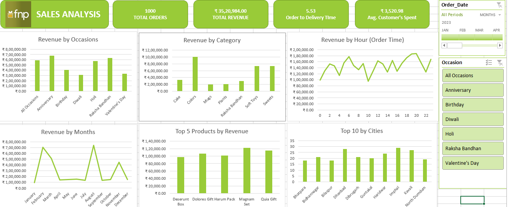

# Ferns and Petals Sales Analysis (FnP-data-analysis)

## 📊 Project Overview
This project analyzes sales data from Ferns and Petals (FNP), a leading gifting platform specializing in gifts for occasions such as Diwali, Raksha Bandhan, Holi, Valentine's Day, Birthdays, and Anniversaries. The goal is to uncover actionable insights into sales trends, customer behavior, and product performance to help FNP optimize its sales strategy and enhance customer satisfaction.

## 🗂️ Dataset Description
The analysis is based on three main CSV files located in the `rawdata/` directory:
- **customers.csv**: Customer details (ID, name, city, contact, gender, address)
- **orders.csv**: Order transactions (order ID, customer ID, product ID, quantity, order/delivery dates, location, occasion)
- **products.csv**: Product catalog (product ID, name, category, price, occasion, description)

## ❓ Key Business Questions
This project answers the following business-critical questions:
1. **Total Revenue**: What is the overall revenue?
2. **Average Order and Delivery Time**: How long do deliveries take on average?
3. **Monthly Sales Performance**: How do sales fluctuate across the months of 2023?
4. **Top Products by Revenue**: Which products generate the most revenue?
5. **Customer Spending Analysis**: How much do customers spend on average?
6. **Sales Performance by Top 5 Products**: How do the top 5 products perform over time?
7. **Top 10 Cities by Number of Orders**: Which cities place the most orders?
8. **Order Quantity vs. Delivery Time**: Does higher order quantity impact delivery times?
9. **Revenue Comparison Between Occasions**: How does revenue vary by occasion?
10. **Product Popularity by Occasion**: Which products are most popular for each occasion?


## 📁 File Structure
```
FnP-data-analysis/
├── rawdata/
│   ├── customers.csv
│   ├── orders.csv
│   └── products.csv
├── Dashboard.xlsx         # Interactive dashboard (Excel)
├── Ferns and Petals Sales Analysis.pdf  # Project report
├── image.png              # Dashboard/visualization preview
└── README.md
```

## 🖼️ Dashboard Preview
